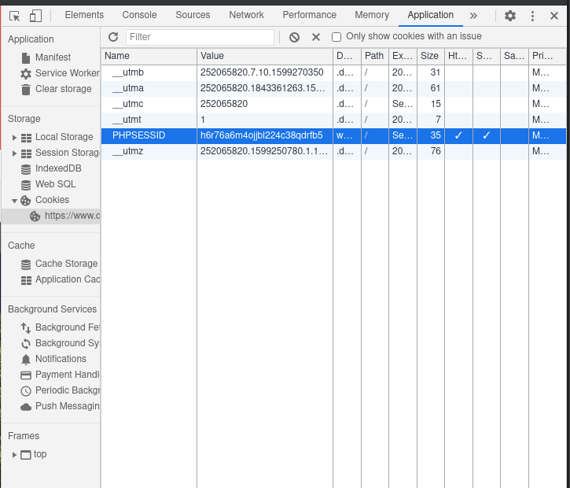

# Case Scraper

This project is for scraping county court records to build a dataset on eviction
cases in Denver and surrounding counties. This readme should serve as a user
guide for anyone who wishes to use it.

## Dependencies

### Service account certificate

You need to reach out to [Jon](mailto:jonathan.p.lamar@gmail.com) or anyone else
who maintains this repo for an access link to the service account that we use
for ingests (this is nothing more than a "fake" account for performing uploads
to google sheets that we all use). This will set you up with a certificate that
allows you to act as this account. You will receive an email with instructions
for accepting the invitation. Once you have completed those, go
[here](https://console.developers.google.com/apis/credentials) and you should
see `for-gspread@case-scraping.iam.gserviceaccount.com` listed under "Service
Accounts" like this:


Click on the account and then click "Add Key" > "Create new key" > "JSON" >
Create. The page will save a json file to your downloads folder. Copy that to
the data filder in this repo and make note of the name.

### Python dependencies

Assuming you have python installed, run `pip install -r requirements.txt` from
the root directory of the repo and it should install every package it needs.

### Selenium

Selenium requires a driver for their chosen driver. I use
[geckodriver](https://github.com/mozilla/geckodriver/releases) for Firefox, but
[here's a list for each browser](https://pypi.org/project/selenium/#drivers) you
could want.

### Dotenv

You need a file in the root of the directory named `.env`. You will use this
file to set global variables like the dates that you want to scrape cases for
and how to title the new tab in the google sheet.

| Variable               | Description                                                   |
| ---------------------- | ------------------------------------------------------------- |
| AIRTABLE_TOKEN         | Deprecated. Used for sending cases to Airtable.               |
| GOOGLE_TOKEN           | Filepath to your Google Service Account token.                |
| FIRST_DATE             | First date to pull from the Denver Courts calendar.           |
| LAST_DATE              | Last date to pull from the Denver Courts calendar.            |
| DENVER_SESS_ID         | The PHP session ID cookie from Denver Courts.                 |
| DENVER_URL_TOKEN       | The URL token from Denver Courts.                             |
| DENVER_OUTPUT_FILENAME | Path and filename for the cases scraped.                      |
| DENVER_WORKSHEET_NAME  | Name of the Google Sheets worksheet to be created or updates. |

## How to run it

### Denver county

Unlike other counties, Denver has its own website. The good news is the
information is much more detailed (allowing us to assemble some stats on past
evictions), but the bad news is the process for scraping is more complicated and
requires a little manual intervention by the user (you).

First you have to go [here](https://www.denvercountycourt.org/courtroom-calendar/)
and enter any date (it doesn't matter) and any courtroom (it also doesn't
matter). Solve the captcha, and you will be taken to the docket for that date
and room. Assuming there are any cases to view, click on one of them. In the
url for the case, there will be a token (alphanumeric characters prefixed with
`&token=`). For example, here is an arbitrary case:

```
denvercountycourt.org/courtroom-calendar/?casenumber=20C50284&date=09/02/2020&room=104&token=53cebb6c22&searchtype=searchdocket
```

The token in this url is `53cebb6c22`. So grab whatever string of characters
you see there. **Note:** Don't copy the `&` character following the token.

Next (and slightly more complicated) is the PHP session ID cookie. This can be
found by going into developer tools in your browser (in chrome or firefox, the
hotkey to open them is Ctrl-Shift-i for windows/linux or Cmd-Shift-i for mac).
A popup window should appear with a bunch of information about the website. You
need to find the value of a cookie called PHPSESSID. In chrome, it should look
like this:



Grab the value of that cookie. If you are using firefox, then it should be
located under the "Storage" tab.

Next, in the `.env` file, set the following variables:

```bash
GOOGLE_TOKEN="Relative file path to your copy of the service account certificate"
FIRST_DATE="YYYY-MM-DD"
LAST_DATE="YYYY-MM-DD"
DENVER_SESS_ID="The PHP session ID cookie"
DENVER_URL_TOKEN="The URL token"
DENVER_OUTPUT_FILENAME="data/${FIRST_DATE}__${LAST_DATE}.csv"
DENVER_WORKSHEET_NAME="${FIRST_DATE}__${LAST_DATE}"
```

Once these are set, run `python scrape_denver.py` from the root directory and it
should complete automatically.

### Other counties

**TODO:** Write detailed instructions.
